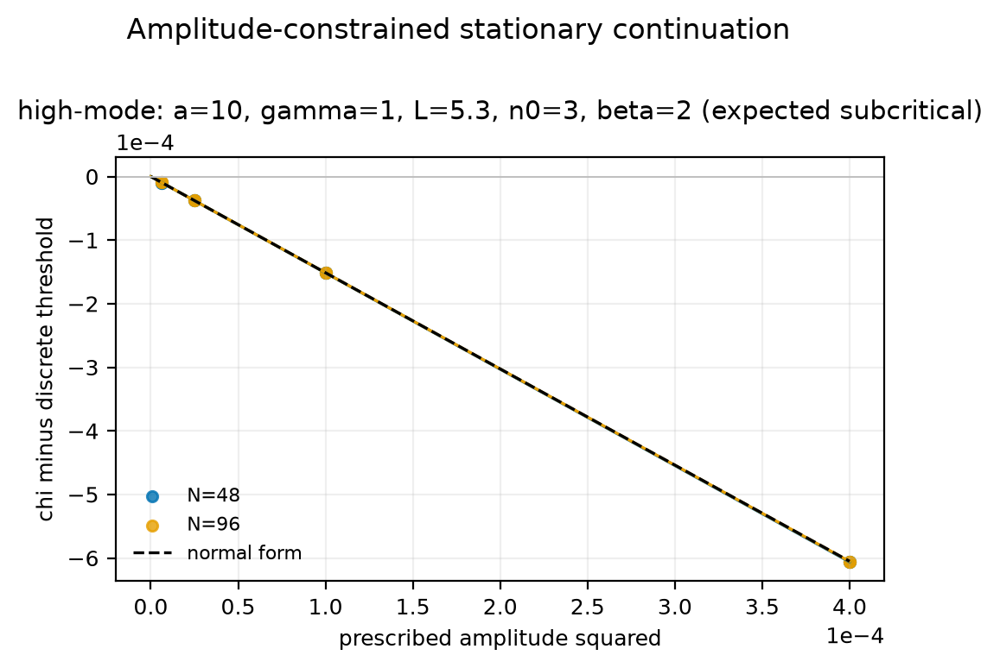
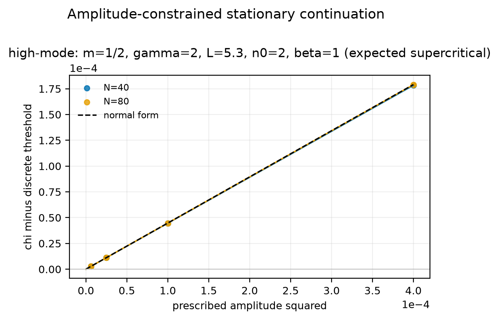
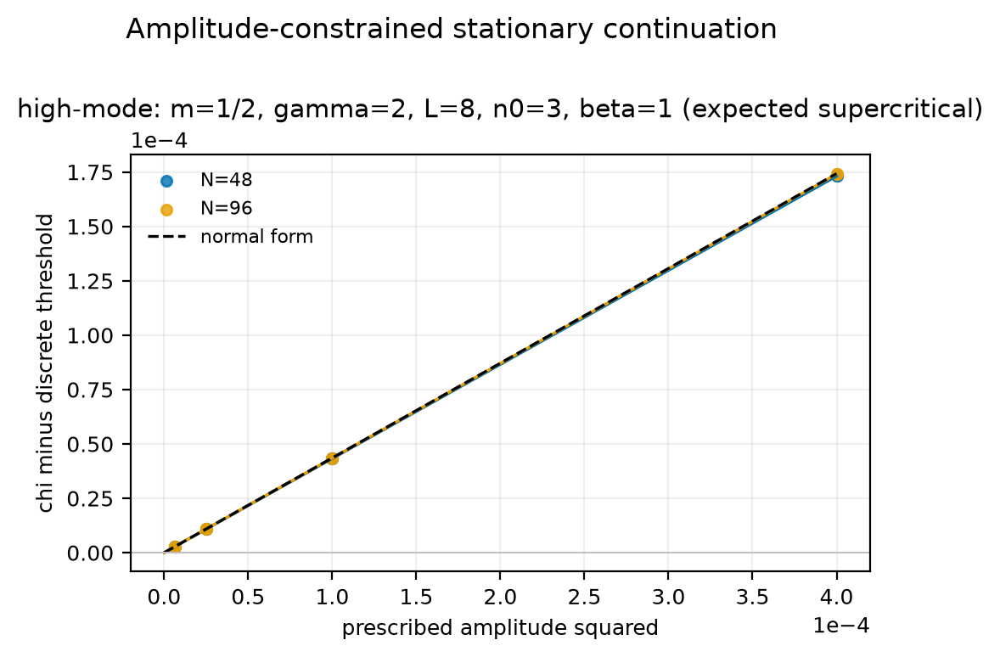

# Curated Paper III results

!!! info "Working companion — evolving, not yet distributed"
    This site is the coauthor-facing view of the Paper III computations while
    the paper is being prepared. Content evolves as results come in. It is not
    being distributed until the manuscript is submitted to a journal and
    arXiv, at which point a milestone tag will freeze the results to match the
    paper. Access is not restricted, so please note the evidence tier attached
    to anything you read here.

The release contains one complete stationary-continuation study and two
selected time-integration figure families. These are the only reader-facing
numerical objects. The larger historical archive is preserved for provenance,
but folder names and legacy galleries do not define evidence status.

## Stationary continuation across four regimes

  Validated current · v1
  4 cases · 3 meshes · 8 amplitudes · 96 states

### The local coefficient, measured independently

Instead of integrating in time, this experiment prescribes the signed
first-cosine amplitude and solves the stationary finite-difference equations.
For each mesh it fits

\[
\chi_h(A)-\chi_h^*=c_{2,h}A^2+c_{4,h}A^4,
\]

then compares \(c_{2,h}\) with the analytical value
\(\beta_{n_0}/\alpha_{n_0}\).

| Case | Direction | Theory \(c_2\) | \(c_{2,160}\) | Finest relative error |
| --- | --- | ---: | ---: | ---: |
| Non-minimal `a=10, beta=0` | Supercritical | `0.0084254463` | `0.0084220572` | `4.02e-4` |
| Non-minimal `beta=3` | Subcritical | `-19.66671032` | `-19.64492609` | `1.11e-3` |
| Minimal `m=gamma=1` | Supercritical | `1.922989917` | `1.922366447` | `3.24e-4` |
| Minimal `m=gamma=2` | Subcritical | `-1.148587331` | `-1.150522206` | `1.68e-3` |

The coefficient errors refine at observed order `1.998--2.009`. All 780 of
780 acceptance gates pass. The largest full stationary `u` residual is
`8.51e-11`, the largest independently reconstructed elliptic residual is
`1.14e-10`, and the largest fixed-mass error is `3.33e-16`.

[Immutable v1 bundle](https://github.com/chenle02/Chemataxis_Numerics/tree/master/docs/results/paper-iii/stationary-continuation/v1){ .md-button .md-button--primary }
[Fit summary](https://github.com/chenle02/Chemataxis_Numerics/blob/master/docs/results/paper-iii/stationary-continuation/v1/fit-summary.json){ .md-button }
[Checksums](https://github.com/chenle02/Chemataxis_Numerics/blob/master/docs/results/paper-iii/stationary-continuation/v1/SHA256SUMS){ .md-button }
[Vector figure](../assets/images/paper3-stationary-continuation.pdf){ .md-button }

## Near-threshold time integration

These two three-panel composites are the time-dependent figures retained in
the manuscript. They use fixed perturbations and report semidiscrete behavior
on the named archives.

### Quasi-linear supercritical benchmark

  Validated current
  Logistic equilibrium · mode n = 1

#### Parameters: a=10, b=alpha=m=gamma=mu=nu=L=1, beta=0

The full center-graph calculation gives

\[
\chi^*=2.188281623751274,
\qquad
\beta_{1}=0.076503080515203>0.
\]

The below-threshold trajectory returns toward the constant state; the two
above-threshold trajectories approach symmetry-related patterns. For the
1%-above run, the final cosine amplitude is `1.62372574646`, compared with the
leading-order prediction `1.61159217017`.

[Raw validated family](https://github.com/chenle02/Chemataxis_Numerics/tree/master/docs/results/quasilinear/supercritical/a10_b1_alpha1_m1_beta0_gamma1_mu1_nu1_L1_n1){ .md-button }
[Corrected constants](https://github.com/chenle02/Chemataxis_Numerics/blob/master/docs/results/quasilinear/supercritical/a10_b1_alpha1_m1_beta0_gamma1_mu1_nu1_L1_n1/constants.json){ .md-button }
[Vector figure](../assets/images/paper3-supercritical-quasilinear.pdf){ .md-button }

### Nonlinear-mobility supercritical benchmark

  Validated current
  Logistic equilibrium · mode n = 1

#### Parameters: a=b=alpha=1, m=2, beta=1, gamma=2, mu=nu=L=1

The corrected analytical values are

\[
\chi^*=11.970925584731697,
\qquad
\beta_{1}=9.508880363384589>0.
\]

Fixed positive and negative seeds above threshold produce opposite patterned
trajectories, while the selected below-threshold run decays. This family tests
nonlinear chemotactic mobility and nonlinear signal production.

[Raw validated family](https://github.com/chenle02/Chemataxis_Numerics/tree/master/docs/results/nonlinear_beta_gamma/supercritical/a1_b1_alpha1_m2_beta1_gamma2_mu1_nu1_L1_n1){ .md-button }
[Corrected constants](https://github.com/chenle02/Chemataxis_Numerics/blob/master/docs/results/nonlinear_beta_gamma/supercritical/a1_b1_alpha1_m2_beta1_gamma2_mu1_nu1_L1_n1/constants.json){ .md-button }
[Vector figure](../assets/images/paper3-supercritical-nonlinear.pdf){ .md-button }

## Approaching the threshold: the square-root amplitude law

  New 2026-08 · not yet promoted
  6 offsets · both seeds · all runs converged

### Why the earlier pictures looked far from the constant state

The published time-integration panels sit at \(+1\%\), \(+2\%\) and \(+5\%\)
above \(\chi^*\), where the amplitude is already \(O(0.3)\)–\(O(0.5)\). That is
not near threshold. Theory predicts

\[
A(\chi_0)\sim\sqrt{\frac{\chi_0-\chi^*(u^*)}{c_2}},
\qquad c_2=\frac{\beta_{n_0}}{\alpha_{n_0}},
\]

so the branch collapses onto the constant state as \(\chi_0\downarrow\chi^*\).
This sweep goes down to \(+0.1\%\) on the supercritical family
\(m=\tfrac12,\ \gamma=2,\ L=5.3,\ n_0=2,\ \beta=1\), with
\(\chi^*=4.116954\), \(\alpha_{n_0}=0.584273\), \(\beta_{n_0}=0.261571\),
\(c_2=0.447686\).

| Offset | \(\chi_0-\chi^*\) | \(\lvert A\rvert\) measured | \(\sqrt{(\chi_0-\chi^*)/c_2}\) | Relative deviation |
| --- | ---: | ---: | ---: | ---: |
| `+0.1%` | `4.1170e-03` | `0.09591` | `0.09590` | `+0.0%` |
| `+0.25%` | `1.0292e-02` | `0.14964` | `0.15162` | `-1.3%` |
| `+0.5%` | `2.0585e-02` | `0.20797` | `0.21443` | `-3.0%` |
| `+1%` | `4.1170e-02` | `0.28000` | `0.30325` | `-7.7%` |
| `+2%` | `8.2339e-02` | `0.38160` | `0.42886` | `-11.0%` |
| `+5%` | `2.0585e-01` | `0.52590` | `0.67809` | `-22.4%` |

At \(+0.1\%\) the measured amplitude matches the prediction to four significant
figures, and \(A(+\varepsilon)=-A(-\varepsilon)\) to every digit shown. The
log–log slope is `0.4811` over the three near-threshold offsets and `0.4854`
over the two smallest, against \(\tfrac12\) predicted.

!!! warning "Read the near-threshold rows, not the six-point fit"
    A slope fitted over all six offsets gives `0.4381`. That number is
    dominated by the large-offset rows where the quartic term is not small.
    The square-root law is a statement about the limit
    \(\chi_0\downarrow\chi^*\).

### Critical slowing down

The growth rate vanishes at threshold, so the closer the run, the longer it
must be integrated:

| Offset | \(\chi_0-\chi^*\) | Settling time |
| --- | ---: | ---: |
| `+0.1%` | `4.1170e-03` | `2840` |
| `+0.25%` | `1.0292e-02` | `1338` |
| `+0.5%` | `2.0585e-02` | `743` |

This gives \(t_{\text{settle}}\propto(\chi_0-\chi^*)^{-0.833}\). The exponent is
shallower than \(-1\) because
\(t\approx\sigma^{-1}\log(A_\infty/\varepsilon)\) with
\(\sigma\propto\chi_0-\chi^*\), and the logarithmic factor shrinks too; the
combination \(t(\chi_0-\chi^*)/\log(A_\infty/\varepsilon)\) is constant to
within `12%`.

**Practical consequence.** A near-threshold run stopped too early reports an
amplitude that has not settled, and will appear to violate the square-root law.

[Summary JSON](https://github.com/chenle02/Chemataxis_Numerics/blob/master/docs/data/paper-iii-amplitude-law.json){ .md-button }

## Subcritical families above the direction-reversal threshold

  New 2026-08 · not yet promoted
  4 families · 3 meshes each

A family is subcritical only when \(\beta>\beta^+\), the unique positive root of
\(\beta_{n_0}\). Several archived runs sit *below* their own \(\beta^+\) and are
therefore supercritical at their own parameters, which is why no branch appears
below \(\chi^*\) for them. The four families here are evaluated above
\(\beta^+\); in every case \(\chi_h(A)<\chi_h^*\) at every prescribed amplitude.

| \(m\) | \(\gamma\) | \(L\) | \(n_0\) | \(\beta^+\) | \(\beta\) | Finest \(N\) | Measured \(c_2\) | Theory \(c_2\) | Rel. error | Order |
| ---: | ---: | ---: | ---: | ---: | ---: | ---: | ---: | ---: | ---: | ---: |
| `0.5` | `2` | `1.0` | `1` | `2.540` | `3` | `160` | `-5.07897` | `-5.08775` | `1.7e-03` | `2.000` |
| `0.5` | `3` | `5.3` | `2` | `4.369` | `5` | `640` | `-15.04668` | `-15.02116` | `1.7e-03` | `2.004` |
| `0.5` | `3` | `8.0` | `3` | `4.318` | `5` | `768` | `-16.55107` | `-16.51077` | `2.4e-03` | `2.003` |
| `2` | `2` | `1.0` | `1` | `5.312` | `6` | `320` | `-55.27701` | `-55.47344` | `3.5e-03` | `1.984` |

All with \(a=b=\alpha=\mu=\nu=1\) and \(u^*=1\).

!!! note "Disclosed diagnostic, and two families out of range"
    The free-intercept discrepancy, at most `3.93e-10` for the v1 benchmarks,
    reaches `1.7e-09`, `1.6e-09` and `1.3e-07` for rows 2–4. It is a property of
    the quartic *fit*, not of the branch: halving the amplitude window drops it
    by more than an order of magnitude while \(c_2\) is unchanged to all
    reported digits. The published amplitude set was kept rather than narrowed.

    Two further families require \(\beta^+\approx27.8\) and \(\approx40.2\).
    Since \(\chi^*\propto2^{\beta}\) at \(v^*=1\), those need sensitivities of
    order \(10^{9}\) and \(10^{13}\), so they are out of range and are not
    reported.

## Provenance boundary

Four earlier families remain versioned but are excluded from the current
contract: two time-dependent minimal-model archives with conservation or
classification problems, the obsolete `beta=3` coefficient-seeded runs, and
the reclassified all-ones coefficient-seeded runs. Their exact Git paths and
reasons are recorded under `provenance_only` in the
[manifest](../data/paper-iii-manifest.json); this page intentionally provides
no galleries or preview links for them.

!!! note "Scientific scope"
    The figures and fitted coefficients are evidence about the spatially
    semidiscrete computations. The continuous-PDE conclusions come from the
    manuscript's analysis.

## Candidate stationary cases (not validated evidence)

!!! warning "These are candidates, not results of this paper"
    The twelve bundles below are **not** part of the Paper III evidence
    contract and must not be cited as validated. They are published so the
    computation is inspectable and reproducible, at an explicitly lower tier
    than the four `validated_current` stationary cases above. Promotion to
    `validated_current` is an author decision that has not been taken.

Each candidate extends the stationary-continuation study to a nontrivial
critical mode (n₀ = 2 or 3) or to a new sensitivity exponent. Every bundle
carries the same artifact set as the validated v1 bundle, plus the exact
`run-card.yaml` it was generated from, and each is checked in CI by the same
machinery that guards v1:

- every file hash in `SHA256SUMS` is re-derived from the committed Git object;
- the generating tree must have been clean;
- the bundle's own acceptance gates must all pass;
- the continuum minimizing mode must equal the declared critical mode;
- `theory_c2` must equal `beta_n0 / alpha_n0`, with `alpha_n0 > 0`; and
- the **label gate**: the sign of the measured branch slope `c₂` at the finest
  mesh must equal the sign of the closed-form `beta_n0`, which must in turn
  agree with the declared regime.

The manifest's numbers for each candidate are compared against the bundle
itself, so a manifest entry cannot disagree with the artifact it describes.

Twelve candidate bundles are published. Every row below is read from the
bundle's own `fit-summary.json`; the site cannot disagree with the artifacts.

| Case | family | L | n₀ | β | closed-form β_{n₀} | measured c₂ (finest) | order | gates | regime |
|---|---|---:|---:|---:|---:|---:|---:|:---:|---|
| [`hm-a10-g1-L3p5-n2-beta0`](paper-iii/stationary-continuation/candidates/hm-a10-g1-L3p5-n2-beta0/) | a=10, &gamma;=1 | 3.5 | 2 | 0 | +0.118097 | +0.015458 | 2.001 | 183/183 | supercritical |
| [`hm-a10-g1-L3p5-n2-beta2`](paper-iii/stationary-continuation/candidates/hm-a10-g1-L3p5-n2-beta2/) | a=10, &gamma;=1 | 3.5 | 2 | 2 | -0.094491 | -1.498507 | 1.975 | 123/123 | subcritical |
| [`hm-a10-g1-L5p3-n3-beta0`](paper-iii/stationary-continuation/candidates/hm-a10-g1-L5p3-n3-beta0/) | a=10, &gamma;=1 | 5.3 | 3 | 0 | +0.121382 | +0.015951 | 1.999 | 183/183 | supercritical |
| [`hm-a10-g1-L5p3-n3-beta2`](paper-iii/stationary-continuation/candidates/hm-a10-g1-L5p3-n3-beta2/) | a=10, &gamma;=1 | 5.3 | 3 | 2 | -0.094990 | -1.513524 | 1.963 | 123/123 | subcritical |
| [`hm-m05-g2-L5p3-n2-beta1`](paper-iii/stationary-continuation/candidates/hm-m05-g2-L5p3-n2-beta1/) | m=0.5, &gamma;=2 | 5.3 | 2 | 1 | +0.261571 | +0.447162 | 1.997 | 123/123 | supercritical |
| [`hm-m05-g2-L5p3-n2-beta2`](paper-iii/stationary-continuation/candidates/hm-m05-g2-L5p3-n2-beta2/) | m=0.5, &gamma;=2 | 5.3 | 2 | 2 | -0.447701 | -1.536975 | 2.005 | 123/123 | subcritical |
| [`hm-m05-g2-L8-n3-beta1`](paper-iii/stationary-continuation/candidates/hm-m05-g2-L8-n3-beta1/) | m=0.5, &gamma;=2 | 8 | 3 | 1 | +0.253238 | +0.434907 | 1.996 | 123/123 | supercritical |
| [`hm-m05-g2-L8-n3-beta2`](paper-iii/stationary-continuation/candidates/hm-m05-g2-L8-n3-beta2/) | m=0.5, &gamma;=2 | 8 | 3 | 2 | -0.457315 | -1.580808 | 2.008 | 123/123 | subcritical |
| [`hm-m2-g2-L5p3-n2-beta1`](paper-iii/stationary-continuation/candidates/hm-m2-g2-L5p3-n2-beta1/) | m=2, &gamma;=2 | 5.3 | 2 | 1 | +2.262242 | +3.867491 | 2.000 | 183/183 | supercritical |
| [`hm-m2-g2-L5p3-n2-beta6`](paper-iii/stationary-continuation/candidates/hm-m2-g2-L5p3-n2-beta6/) | m=2, &gamma;=2 | 5.3 | 2 | 6 | -1.351263 | -74.254250 | 2.007 | 123/123 | subcritical |
| [`xover-m05-g2-L5p3-n2-beta0`](paper-iii/stationary-continuation/candidates/xover-m05-g2-L5p3-n2-beta0/) | m=0.5, &gamma;=2 | 5.3 | 2 | 0 | +0.750722 | +0.641305 | 2.000 | 183/183 | supercritical |
| [`xover-m05-g2-L5p3-n2-beta3`](paper-iii/stationary-continuation/candidates/xover-m05-g2-L5p3-n2-beta3/) | m=0.5, &gamma;=2 | 5.3 | 2 | 3 | -1.377093 | -9.441942 | 2.001 | 183/183 | subcritical |

`c₂` is the measured branch slope at the finest mesh and `β_{n₀}` the
closed-form cubic coefficient; they carry the same sign because
`c₂ = β_{n₀}/α_{n₀}` with `α_{n₀} > 0`. Observed orders are the empirical
mesh-refinement rates.

### Figures

-   **`hm-a10-g1-L3p5-n2-beta0`**

    

    L=3.5, n₀=2, β=0 · β_{n₀}=+0.1181 · c₂=+0.0155 · **supercritical**

-   **`hm-a10-g1-L3p5-n2-beta2`**

    

    L=3.5, n₀=2, β=2 · β_{n₀}=-0.0945 · c₂=-1.4985 · **subcritical**

-   **`hm-a10-g1-L5p3-n3-beta0`**

    

    L=5.3, n₀=3, β=0 · β_{n₀}=+0.1214 · c₂=+0.0160 · **supercritical**

-   **`hm-a10-g1-L5p3-n3-beta2`**

    

    L=5.3, n₀=3, β=2 · β_{n₀}=-0.0950 · c₂=-1.5135 · **subcritical**

-   **`hm-m05-g2-L5p3-n2-beta1`**

    

    L=5.3, n₀=2, β=1 · β_{n₀}=+0.2616 · c₂=+0.4472 · **supercritical**

-   **`hm-m05-g2-L5p3-n2-beta2`**

    

    L=5.3, n₀=2, β=2 · β_{n₀}=-0.4477 · c₂=-1.5370 · **subcritical**

-   **`hm-m05-g2-L8-n3-beta1`**

    

    L=8, n₀=3, β=1 · β_{n₀}=+0.2532 · c₂=+0.4349 · **supercritical**

-   **`hm-m05-g2-L8-n3-beta2`**

    

    L=8, n₀=3, β=2 · β_{n₀}=-0.4573 · c₂=-1.5808 · **subcritical**

-   **`hm-m2-g2-L5p3-n2-beta1`**

    

    L=5.3, n₀=2, β=1 · β_{n₀}=+2.2622 · c₂=+3.8675 · **supercritical**

-   **`hm-m2-g2-L5p3-n2-beta6`**

    

    L=5.3, n₀=2, β=6 · β_{n₀}=-1.3513 · c₂=-74.2543 · **subcritical**

-   **`xover-m05-g2-L5p3-n2-beta0`**

    

    L=5.3, n₀=2, β=0 · β_{n₀}=+0.7507 · c₂=+0.6413 · **supercritical**

-   **`xover-m05-g2-L5p3-n2-beta3`**

    

    L=5.3, n₀=2, β=3 · β_{n₀}=-1.3771 · c₂=-9.4419 · **subcritical**

### β-dependence of the bifurcation direction

!!! question "Numerical response to Wenxian's question of 2025-12-07"
    Wenxian asked whether β affects the bifurcation *direction*, not only the
    threshold. These four measurements are in the same family
    (m=1/2, gamma=2, L=5.3, n0=2), with β the only quantity moved. They are reported as
    measurements; whether this becomes a named result in the paper is hers to
    decide.

| β | closed-form β_{n₀} | measured c₂ (finest) | measured direction |
|---:|---:|---:|---|
| 0 | +0.750722 | +0.641305 | supercritical |
| 1 | +0.261571 | +0.447162 | supercritical |
| 2 | -0.447701 | -1.536975 | subcritical |
| 3 | -1.377093 | -9.441942 | subcritical |

The measured direction changes between β = 1 and β = 2, bracketing the positive
root of the closed-form quadratic in β (β⁺ ≈ 1.406 for this family).

Each bundle folder carries a `README.md` with its parameters, measured
numbers, and a reproduction command; browse them on
[GitHub](https://github.com/chenle02/Chemataxis_Numerics/tree/master/docs/results/paper-iii/stationary-continuation/candidates).
Every bundle path is also listed under `candidate_stationary_cases` in the
[evidence manifest](../data/paper-iii-manifest.json). Folder names are
provenance identifiers, not evidence classifications.

## Machine-readable record

The [Paper III evidence manifest](../data/paper-iii-manifest.json) freezes the
two evidence layers, all source revisions, figure hashes, v1 checksums, case
IDs, branch slopes, acceptance metrics, and provenance exclusions. CI resolves
every declared object from Git and rejects a reader-facing link to any
provenance-only raw family. Candidate cases are recorded separately under
`candidate_stationary_cases` and are excluded from the reader-facing contract.
