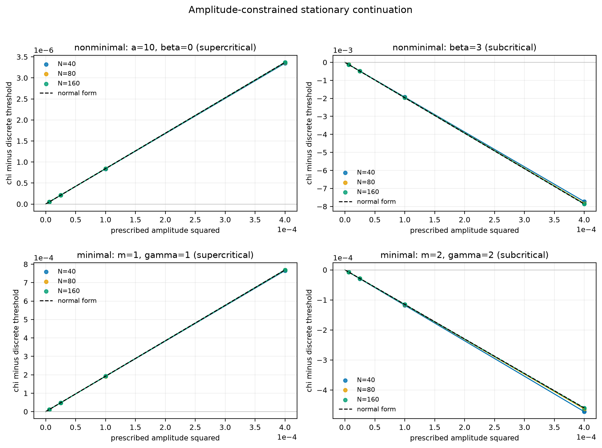
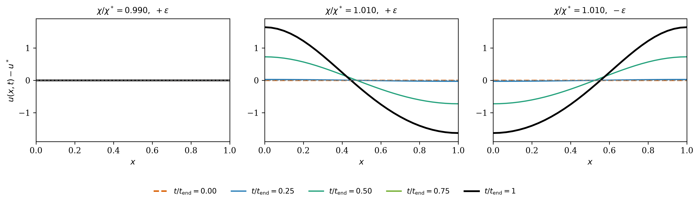
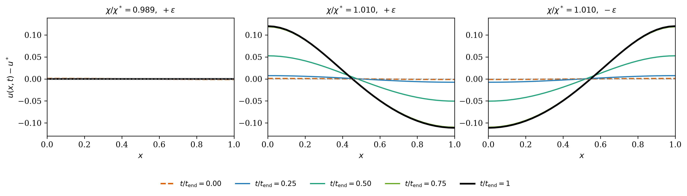

# Curated Paper III results

The release contains one complete stationary-continuation study and two
selected time-integration figure families. These are the only reader-facing
numerical objects. The larger historical archive is preserved for provenance,
but folder names and legacy galleries do not define evidence status.

## Stationary continuation across four regimes

  Validated current · v1
  4 cases · 3 meshes · 8 amplitudes · 96 states

### The local coefficient, measured independently

Instead of integrating in time, this experiment prescribes the signed
first-cosine amplitude and solves the stationary finite-difference equations.
For each mesh it fits

\[
\chi_h(A)-\chi_h^*=c_{2,h}A^2+c_{4,h}A^4,
\]

then compares \(c_{2,h}\) with the analytical value
\(\beta_{n_0}/\alpha_{n_0}\).

| Case | Direction | Theory \(c_2\) | \(c_{2,160}\) | Finest relative error |
| --- | --- | ---: | ---: | ---: |
| Non-minimal `a=10, beta=0` | Supercritical | `0.0084254463` | `0.0084220572` | `4.02e-4` |
| Non-minimal `beta=3` | Subcritical | `-19.66671032` | `-19.64492609` | `1.11e-3` |
| Minimal `m=gamma=1` | Supercritical | `1.922989917` | `1.922366447` | `3.24e-4` |
| Minimal `m=gamma=2` | Subcritical | `-1.148587331` | `-1.150522206` | `1.68e-3` |

The coefficient errors refine at observed order `1.998--2.009`. All 780 of
780 acceptance gates pass. The largest full stationary `u` residual is
`8.51e-11`, the largest independently reconstructed elliptic residual is
`1.14e-10`, and the largest fixed-mass error is `3.33e-16`.

[Immutable v1 bundle](https://github.com/chenle02/Chemataxis_Numerics/tree/master/docs/results/paper-iii/stationary-continuation/v1){ .md-button .md-button--primary }
[Fit summary](https://github.com/chenle02/Chemataxis_Numerics/blob/master/docs/results/paper-iii/stationary-continuation/v1/fit-summary.json){ .md-button }
[Checksums](https://github.com/chenle02/Chemataxis_Numerics/blob/master/docs/results/paper-iii/stationary-continuation/v1/SHA256SUMS){ .md-button }
[Vector figure](../assets/images/paper3-stationary-continuation.pdf){ .md-button }

## Near-threshold time integration

These two three-panel composites are the time-dependent figures retained in
the manuscript. They use fixed perturbations and report semidiscrete behavior
on the named archives.

### Quasi-linear supercritical benchmark

  Validated current
  Logistic equilibrium · mode n = 1

#### Parameters: a=10, b=alpha=m=gamma=mu=nu=L=1, beta=0

The full center-graph calculation gives

\[
\chi^*=2.188281623751274,
\qquad
\beta_{1}=0.076503080515203>0.
\]

The below-threshold trajectory returns toward the constant state; the two
above-threshold trajectories approach symmetry-related patterns. For the
1%-above run, the final cosine amplitude is `1.62372574646`, compared with the
leading-order prediction `1.61159217017`.

[Raw validated family](https://github.com/chenle02/Chemataxis_Numerics/tree/master/docs/results/quasilinear/supercritical/a10_b1_alpha1_m1_beta0_gamma1_mu1_nu1_L1_n1){ .md-button }
[Corrected constants](https://github.com/chenle02/Chemataxis_Numerics/blob/master/docs/results/quasilinear/supercritical/a10_b1_alpha1_m1_beta0_gamma1_mu1_nu1_L1_n1/constants.json){ .md-button }
[Vector figure](../assets/images/paper3-supercritical-quasilinear.pdf){ .md-button }

### Nonlinear-mobility supercritical benchmark

  Validated current
  Logistic equilibrium · mode n = 1

#### Parameters: a=b=alpha=1, m=2, beta=1, gamma=2, mu=nu=L=1

The corrected analytical values are

\[
\chi^*=11.970925584731697,
\qquad
\beta_{1}=9.508880363384589>0.
\]

Fixed positive and negative seeds above threshold produce opposite patterned
trajectories, while the selected below-threshold run decays. This family tests
nonlinear chemotactic mobility and nonlinear signal production.

[Raw validated family](https://github.com/chenle02/Chemataxis_Numerics/tree/master/docs/results/nonlinear_beta_gamma/supercritical/a1_b1_alpha1_m2_beta1_gamma2_mu1_nu1_L1_n1){ .md-button }
[Corrected constants](https://github.com/chenle02/Chemataxis_Numerics/blob/master/docs/results/nonlinear_beta_gamma/supercritical/a1_b1_alpha1_m2_beta1_gamma2_mu1_nu1_L1_n1/constants.json){ .md-button }
[Vector figure](../assets/images/paper3-supercritical-nonlinear.pdf){ .md-button }

## Provenance boundary

Four earlier families remain versioned but are excluded from the current
contract: two time-dependent minimal-model archives with conservation or
classification problems, the obsolete `beta=3` coefficient-seeded runs, and
the reclassified all-ones coefficient-seeded runs. Their exact Git paths and
reasons are recorded under `provenance_only` in the
[manifest](../data/paper-iii-manifest.json); this page intentionally provides
no galleries or preview links for them.

!!! note "Scientific scope"
    The figures and fitted coefficients are evidence about the spatially
    semidiscrete computations. The continuous-PDE conclusions come from the
    manuscript's analysis.

## Candidate stationary cases (not validated evidence)

!!! warning "These are candidates, not results of this paper"
    The twelve bundles below are **not** part of the Paper III evidence
    contract and must not be cited as validated. They are published so the
    computation is inspectable and reproducible, at an explicitly lower tier
    than the four `validated_current` stationary cases above. Promotion to
    `validated_current` is an author decision that has not been taken.

Each candidate extends the stationary-continuation study to a nontrivial
critical mode (n₀ = 2 or 3) or to a new sensitivity exponent. Every bundle
carries the same artifact set as the validated v1 bundle, plus the exact
`run-card.yaml` it was generated from, and each is checked in CI by the same
machinery that guards v1:

- every file hash in `SHA256SUMS` is re-derived from the committed Git object;
- the generating tree must have been clean;
- the bundle's own acceptance gates must all pass;
- the continuum minimizing mode must equal the declared critical mode;
- `theory_c2` must equal `beta_n0 / alpha_n0`, with `alpha_n0 > 0`; and
- the **label gate**: the sign of the measured branch slope `c₂` at the finest
  mesh must equal the sign of the closed-form `beta_n0`, which must in turn
  agree with the declared regime.

The manifest's numbers for each candidate are compared against the bundle
itself, so a manifest entry cannot disagree with the artifact it describes.

Bundles live under `docs/results/paper-iii/stationary-continuation/candidates/`
in the repository; every bundle path is listed under
`candidate_stationary_cases` in the
[evidence manifest](../data/paper-iii-manifest.json). Folder names are
provenance identifiers, not evidence classifications.

## Machine-readable record

The [Paper III evidence manifest](../data/paper-iii-manifest.json) freezes the
two evidence layers, all source revisions, figure hashes, v1 checksums, case
IDs, branch slopes, acceptance metrics, and provenance exclusions. CI resolves
every declared object from Git and rejects a reader-facing link to any
provenance-only raw family. Candidate cases are recorded separately under
`candidate_stationary_cases` and are excluded from the reader-facing contract.
