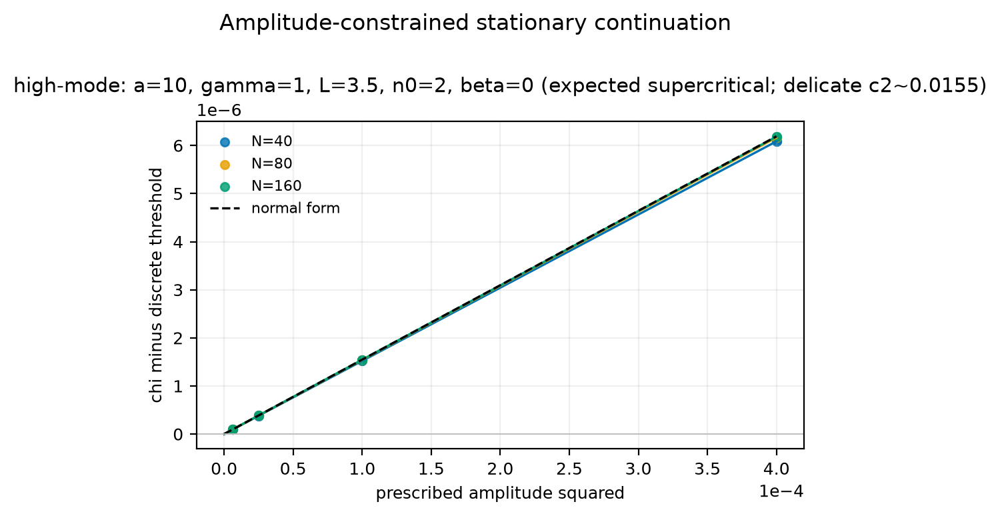

# `hm-a10-g1-L3p5-n2-beta0`

!!! warning "Candidate, not validated evidence"
    Not part of the Paper III evidence contract; must not be cited as a
    validated result.



## What was run

Amplitude-constrained stationary continuation of the non-minimal model, with
the signed first-cosine amplitude as the continuation parameter.

| quantity | value |
|---|---|
| a, b, α | 10, 1, 1 |
| m, γ | 1, 1 |
| β | 0 |
| domain length L | 3.5 |
| critical mode n₀ | 2 |
| χ\*(β) | 1.732569 |
| closed-form β_{n₀} | +0.11809712 |
| α_{n₀} | 7.63186261 |
| meshes | 40, 80, 160 |
| measured c₂ (N=160) | +0.01545793 |
| theory c₂ = β_{n₀}/α_{n₀} | +0.01547422 |
| relative error (finest) | 1.053e-03 |
| observed order | 2.001 |
| acceptance gates | 183/183 passed |
| measured direction | **supercritical** |

## Files

`run-card.yaml` (exact input) · `fit-summary.json` (methods, provenance, gates)
· `branch-points.csv` · `stationary-profiles.csv` · `stationary-states.npz` ·
`states-index.json` · `stationary-continuation.pdf` / `.png` · `SHA256SUMS`

## Reproduce

```bash
python stationary_branch_validation.py \
  --case-file run-card.yaml \
  --meshes 40,80,160 \
  --output-dir /tmp/hm-a10-g1-L3p5-n2-beta0 --check
```

Verify the published bytes:

```bash
sha256sum --check SHA256SUMS
```
