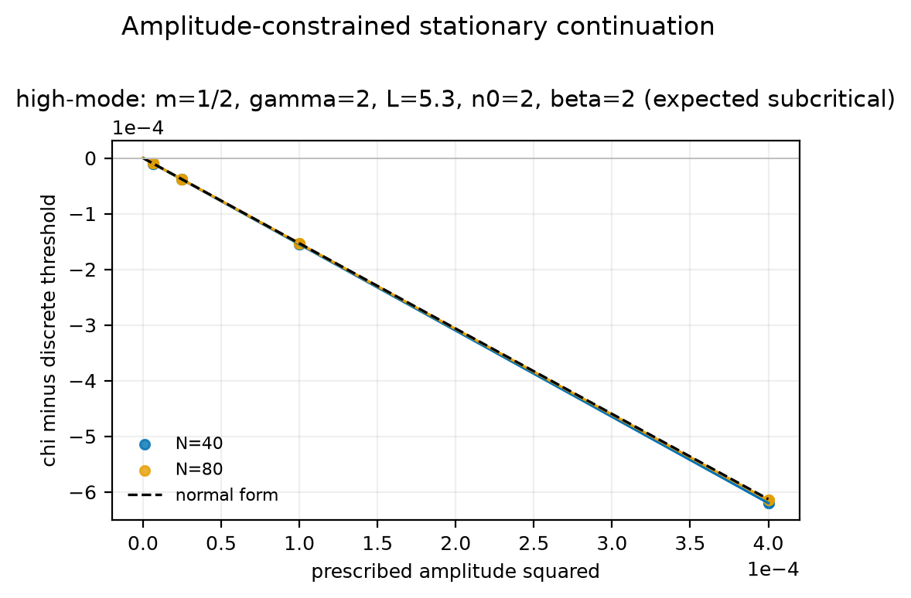

# `hm-m05-g2-L5p3-n2-beta2`

!!! warning "Candidate, not validated evidence"
    Not part of the Paper III evidence contract; must not be cited as a
    validated result.



## What was run

Amplitude-constrained stationary continuation of the non-minimal model, with
the signed first-cosine amplitude as the continuation parameter.

| quantity | value |
|---|---|
| a, b, α | 1, 1, 1 |
| m, γ | 0.5, 2 |
| β | 2 |
| domain length L | 5.3 |
| critical mode n₀ | 2 |
| χ\*(β) | 8.233908 |
| closed-form β_{n₀} | -0.44770053 |
| α_{n₀} | 0.29213662 |
| meshes | 40, 80 |
| measured c₂ (N=80) | -1.53697543 |
| theory c₂ = β_{n₀}/α_{n₀} | -1.53250399 |
| relative error (finest) | 2.918e-03 |
| observed order | 2.005 |
| acceptance gates | 123/123 passed |
| measured direction | **subcritical** |

## Files

`run-card.yaml` (exact input) · `fit-summary.json` (methods, provenance, gates)
· `branch-points.csv` · `stationary-profiles.csv` · `stationary-states.npz` ·
`states-index.json` · `stationary-continuation.pdf` / `.png` · `SHA256SUMS`

## Reproduce

```bash
python stationary_branch_validation.py \
  --case-file run-card.yaml \
  --meshes 40,80 \
  --output-dir /tmp/hm-m05-g2-L5p3-n2-beta2 --check
```

Verify the published bytes:

```bash
sha256sum --check SHA256SUMS
```
